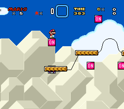

# On/Off States for Any Line-Guide #
by elusive  
based on Line-Guide "Acts Like" Fix, by imamelia  
with modifications by worldpeace  
please credit the original author(s) as well

This patch makes it possible to have on/off states for any line-guide. The default settings will allow you to have on/off states for *every* line-guide, i.e. each line active in the on state, or active in the off state.

## Table of Contents ##
+ [Installation](#installation)
  - [Patch](#patch)
  - [Graphics](#graphics)
  - [Level](#level)
  - [Map16](#map16)
+ [Custom Map16](#custom-map16)

## Installation ##

### Patch ###

Copy the included patch, `onoffanylineguide.asm` (located in the `asm` folder) and paste it with your other asar patches.  
If you want to change the Map16 page (the default is page `10`), change *`!map16page`* in the `.asm` file.  
Apply the patch with asar.
			
### Graphics ###

Insert the included ExGFX file, `ExGFX500.bin` (located in the `ExGFX` folder), into Lunar Magic.  
Change the filename of the `.bin` as needed.  

The vanilla on/off diagonal line drawing is not included, as AN1 (`GFX33.bin`) has this tile.

Rows `0` and `1` are reserved in this file, i.e. the second row (all blank) is used as well.

### Level ###

Next we need to setup the Ex-Animation for the line guides to display properly. If you would like to set this up without inserting a test level, jump to the [Ex-Animation](#ex-animation) section below.

In Lunar Magic, from the "File" menu, click "Open Level from File", and select the included level file, `lineguides.mwl` file (located in the `mwl` folder).  
You will notice that the tiles in the level do not look correct. This will be resolved in the [Map16](#map16) section.

#### Ex-Animation ####

If you did not insert the included level file, open Lunar magic to a level you want to edit.  
Open the level's "Super GFX Bypass" and set AN2 to the included `.bin` file number (the default is `500`).

Setup the level Ex-Animation like the images below (two slots).

The destination animated tiles should look like the images below, on and off respectively.

### Map16 ###

In Lunar Magic, open the 16x16 Tile Map Editor. Click the button to "Import Map16 tiles from file" and select the included Map16 file, `linesguides.map16` (located in the `map16` folder). By default, the tiles imported will be on page `10`. The page you place these tiles on needs match *`!map16page`* in the `.asm` file.

The Map16 page should look like the images below, on and off respectively.

If you inserted the included level file, and also changed the Map16 page, you will need to "Remap Direct Map16 Tiles in Level" so that the tiles in the test level look correct.

The installation is complete.

## Custom Map16 ##

If you do not like the default Map16 pattern, you can change the arrangement by editing the Map16 tiles in your ROM and the tables in the `.asm` file. These are instructions by example. Once you understand these, re-arrange as you like.

The default Map16 pattern, which matches the images above, is as follows:

These are the table defines in the `.asm` file.
<pre>
OnTable:
db $00,$00,$00,$00,$00,$00,$00,$00,$00,<b>$8C</b>,<b>$8D</b>,<i>$00</i>,<b>$88</b>,<b>$25</b>,<b>$91</b>,<b>$90</b> 	; 00-0F 
db $00,$00,$00,$00,$00,$00,$00,$00,$00,<b>$25</b>,<b>$25</b>,<i>$00</i>,<b>$8A</b>,<b>$25</b>,<b>$25</b>,<b>$25</b> 	; 10-1F 
db $00,$00,$00,$00,$00,$00,$00,$00,$00,<b>$25</b>,<b>$25</b>,<b>$25</b>,<b>$25</b>,<b>$89</b>,<b>$93</b>,<b>$25</b> 	; 20-2F 
db $00,$00,$00,$00,$00,$00,$00,$00,$00,<b>$8E</b>,<b>$8F</b>,<b>$87</b>,<b>$25</b>,<b>$8B</b>,<b>$92</b>,<b>$25</b> 	; 30-3F 
db $00,$00,$00,$00,$00,$00,$00,$00,<b>$7A</b>,<b>$7B</b>,<b>$7E</b>,<b>$7F</b>,<b>$25</b>,<b>$25</b>,<b>$25</b>,<b>$25</b> 	; 40-4F 
db $00,$00,$00,$00,$00,$00,$00,$00,<b>$7C</b>,<b>$76</b>,<b>$77</b>,<b>$7D</b>,<b>$25</b>,<b>$25</b>,<b>$25</b>,<b>$25</b> 	; 50-5F 
db $00,$00,$00,$00,$00,$00,$00,$00,<b>$82</b>,<b>$78</b>,<b>$79</b>,<b>$83</b>,<b>$25</b>,<b>$25</b>,<b>$25</b>,<b>$25</b> 	; 60-6F 
db $00,$00,$00,$00,$00,$00,$00,$00,<b>$80</b>,<b>$81</b>,<b>$84</b>,<b>$85</b>,<b>$25</b>,<b>$25</b>,<b>$25</b>,<b>$25</b> 	; 70-7F 
db $00,$00,$00,$00,$00,$00,$00,$00,$00,$00,$00,$00,$00,$00,$00,$00 	; 80-8F 
db $00,$00,$00,$00,$00,$00,$00,$00,$00,$00,$00,$00,$00,$00,$00,$00 	; 90-9F 
db $00,$00,$00,$00,$00,$00,$00,$00,$00,$00,$00,$00,$00,$00,$00,$00 	; A0-AF 
db $00,$00,$00,$00,$00,$00,$00,$00,$00,$00,$00,$00,$00,$00,$00,$00 	; B0-BF 
db $00,$00,$00,$00,$00,$00,$00,$00,$00,$00,$00,$00,$00,$00,$00,$00 	; C0-CF 
db $00,$00,$00,$00,$00,$00,$00,$00,$00,$00,$00,$00,$00,$00,$00,$00 	; D0-DF 
db $00,$00,$00,$00,$00,$00,$00,$00,$00,$00,$00,$00,$00,$00,$00,$00 	; E0-EF 
db $00,$00,$00,$00,$00,$00,$00,$00,$00,$00,$00,$00,$00,$00,$00,$00 	; F0-FF

OffTable:
db $00,$00,$00,$00,$00,$00,$00,$00,$00,<b>$25</b>,<b>$25</b>,<i>$00</i>,<b>$25</b>,<b>$88</b>,<b>$25</b>,<b>$25</b> 	; 00-0F 
db $00,$00,$00,$00,$00,$00,$00,$00,$00,<b>$8E</b>,<b>$8F</b>,<i>$00</i>,<b>$25</b>,<b>$8A</b>,<b>$91</b>,<b>$90</b> 	; 10-1F 
db $00,$00,$00,$00,$00,$00,$00,$00,$00,<b>$8C</b>,<b>$8D</b>,<b>$86</b>,<b>$89</b>,<b>$25</b>,<b>$25</b>,<b>$93</b> 	; 20-2F 
db $00,$00,$00,$00,$00,$00,$00,$00,$00,<b>$25</b>,<b>$25</b>,<b>$25</b>,<b>$8B</b>,<b>$25</b>,<b>$25</b>,<b>$92</b> 	; 30-3F 
db $00,$00,$00,$00,$00,$00,$00,$00,<b>$25</b>,<b>$25</b>,<b>$25</b>,<b>$25</b>,<b>$7A</b>,<b>$7B</b>,<b>$7E</b>,<b>$7F</b> 	; 40-4F 
db $00,$00,$00,$00,$00,$00,$00,$00,<b>$25</b>,<b>$25</b>,<b>$25</b>,<b>$25</b>,<b>$7C</b>,<b>$76</b>,<b>$77</b>,<b>$7D</b> 	; 50-5F 
db $00,$00,$00,$00,$00,$00,$00,$00,<b>$25</b>,<b>$25</b>,<b>$25</b>,<b>$25</b>,<b>$82</b>,<b>$78</b>,<b>$79</b>,<b>$83</b> 	; 60-6F 
db $00,$00,$00,$00,$00,$00,$00,$00,<b>$25</b>,<b>$25</b>,<b>$25</b>,<b>$25</b>,<b>$80</b>,<b>$81</b>,<b>$84</b>,<b>$85</b> 	; 70-7F 
db $00,$00,$00,$00,$00,$00,$00,$00,$00,$00,$00,$00,$00,$00,$00,$00 	; 80-8F 
db $00,$00,$00,$00,$00,$00,$00,$00,$00,$00,$00,$00,$00,$00,$00,$00 	; 90-9F 
db $00,$00,$00,$00,$00,$00,$00,$00,$00,$00,$00,$00,$00,$00,$00,$00 	; A0-AF 
db $00,$00,$00,$00,$00,$00,$00,$00,$00,$00,$00,$00,$00,$00,$00,$00 	; B0-BF 
db $00,$00,$00,$00,$00,$00,$00,$00,$00,$00,$00,$00,$00,$00,$00,$00 	; C0-CF 
db $00,$00,$00,$00,$00,$00,$00,$00,$00,$00,$00,$00,$00,$00,$00,$00 	; D0-DF 
db $00,$00,$00,$00,$00,$00,$00,$00,$00,$00,$00,$00,$00,$00,$00,$00 	; E0-EF 
db $00,$00,$00,$00,$00,$00,$00,$00,$00,$00,$00,$00,$00,$00,$00,$00 	; F0-FF 
</pre>

`$00` denotes tiles that have their value ignored in these tables, i.e. their "Act as" in Lunar Magic will be used.  
**`$xx`** denotes tiles that have their value looked up in these tables, i.e. their "Act as" in either On or Off states.  
*`$00`* denotes the vanilla on/off diagonal tiles. These "Act as" `$94` and `$95` in Lunar Magic.

In Lunar Magic, you can put whatever tiles you want in positions that have <code>$00</code> values in the tables.

The `OnTable` specifies the "Act as" value when the switch is on.  
The `OffTable` specifies the "Act as" value when the switch is off.

Valid values are in the `$76` - `$95` range, i.e. the lines in the image below.  
But `$94` and `$95` are the vanilla on/off diagonal tiles, so they probably don't need to be added to the table defines.

